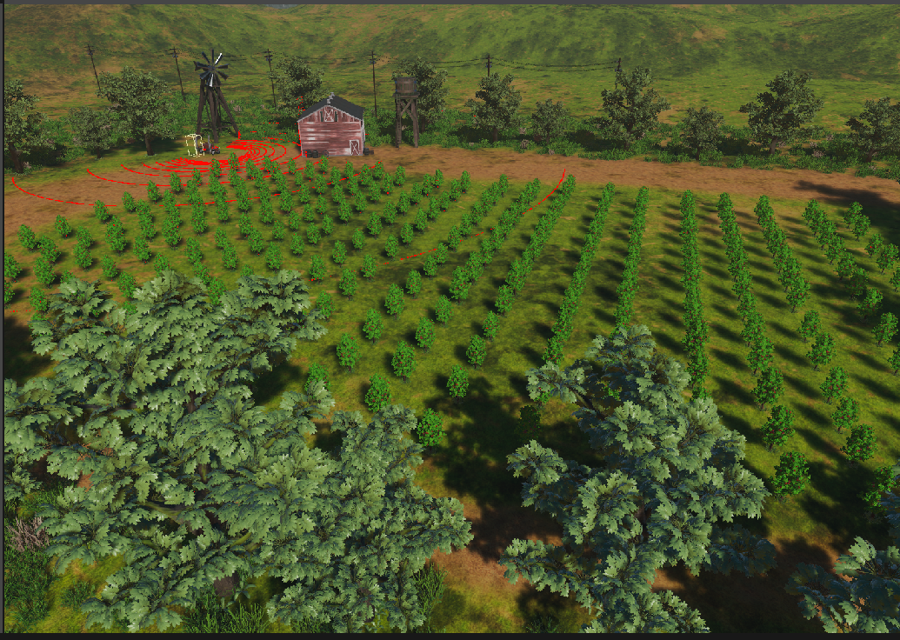

# O3DE Apple Kraken Demo Project (2022)

### Video demo

https://user-images.githubusercontent.com/82551958/229636734-2f67abeb-fe78-432c-8139-e4fc82f008ed.mp4

This project demonstrates an example application of [O3DE](https://www.o3de.org/) working with ROS 2.
The integration is realized through [ROS2 Gem](https://github.com/o3de/o3de-extras/blob/development/Gems/ROS2).
Note that the Gem requirements include installing ROS 2 along with some additional packages. To learn more about how the Gem works, check out [Robotics in O3DE](https://www.o3de.org/docs/user-guide/interactivity/robotics/).

This project was implemented for [ROSCon 2022](https://roscon.ros.org/2022/) event.

## How does it look like




## The project includes

- **Apple Orchard**, a simulation scene with many rows of apple trees.
- **Apple Kraken**, a robot tasked with apple picking.
    - Multiple Apple Krakens are supported
    - .. and you can spawn them using ROS 2 messages!
- **Custom components** for picking apples, which benefit from direct integration with ROS 2.
    - Yes, you can write ROS 2 code in O3DE!
- **Autonomous operation** which is based on ROS 2 navigation stack and ground truth.
    - Ground truth can be replaced with detectors based on sensor data. Give it a try!
- **Apples**
    - Thousands of apples!

## Simulation scenes (levels)

### Main Level

The main scene of the demo is set in an apple orchard surrounded by countryside. The orchard is managed by the Apple Kraken.

The main level is rather performance-intensive.

The Apple Kraken is a four-wheeled robot assigned the task of navigating around the orchard, collecting apples and storing them in its basket.

### Playground Level

The playground scene is much lighter and can be used to quickly prototype with Kraken. There are only a couple of apple trees and the robot itself.

# Requirements

## Platforms

This project was tested on the following platforms:
- Ubuntu 24.04 with ROS 2 Jazzy

> **Note:** The demo is also compatible with Ubuntu 22.04 and ROS 2 Humble, but the navigation launch files target Jazzy and may require adjustments for Humble. ROS 2 Lyrical Luth is **not supported**. The `gazebo_msgs` package used for robot spawning was deprecated in that release.

The ROS2 Gem is not available for Windows.

Refer to the [O3DE System Requirements](https://www.o3de.org/docs/welcome-guide/requirements/) documentation to make sure that the system/hardware requirements are met.

If you wish to run this demo in a _Docker environment_, please use the [instructions](docker/README.md) in the `docker` folder.

## Setup Instructions

The following steps assume a common base folder `$DEMO_BASE` (absolute path). For simplicity, `~/` is used in examples below.

You also need [ROS 2](https://docs.ros.org/en/jazzy/Installation/Ubuntu-Install-Debians.html) installed and sourced:
- for ROS 2 Jazzy: `source /opt/ros/jazzy/setup.bash`
- you can also add this to your `.profile` or `.bashrc`
- verify with `echo $ROS_DISTRO` — you should see `jazzy`

### 1. Install and register the engine

```shell
wget https://o3debinaries.org/main/Latest/Linux/o3de_latest.deb
sudo dpkg -i o3de_latest.deb
/opt/O3DE/26.05/python/get_python.sh
/opt/O3DE/26.05/scripts/o3de.sh register --this-engine
```

### 2. Download and register required Gems

```shell
/opt/O3DE/26.05/scripts/o3de.sh register --repo-uri https://canonical.o3de.org
/opt/O3DE/26.05/scripts/o3de.sh download --gem-name LevelGeoreferencing
/opt/O3DE/26.05/scripts/o3de.sh download --gem-name ROS2
/opt/O3DE/26.05/scripts/o3de.sh download --gem-name ROS2Controllers
/opt/O3DE/26.05/scripts/o3de.sh download --gem-name ROS2Sensors
```

### 3. Additional ROS 2 packages

Install the following additional packages:

```shell
sudo apt install ros-${ROS_DISTRO}-vision-msgs ros-${ROS_DISTRO}-nav-msgs ros-${ROS_DISTRO}-rmw-cyclonedds-cpp ros-${ROS_DISTRO}-cyclonedds
```

### 4. Required environment settings

Add the following to your `~/.bashrc` or equivalent:

```shell
source /opt/ros/jazzy/setup.bash
export RMW_IMPLEMENTATION=rmw_cyclonedds_cpp
```

> **Note:** We recommend CycloneDDS over FastDDS (the default for ROS 2) as we have observed navigation issues with FastDDS.

### 5. Clone and build this project

```shell
cd $DEMO_BASE
git clone https://github.com/o3de/ROSConDemo.git
cd ROSConDemo
git lfs install
git lfs pull
cd Project
cmake -B build/linux -G "Ninja Multi-Config" -DLY_DISABLE_TEST_MODULES=ON -DLY_STRIP_DEBUG_SYMBOLS=TRUE
cmake --build build/linux --config profile --target ROSConDemo ROSConDemo.Assets ROSConDemo.GameLauncher
```

> **Tip:** To reduce download size and disk usage, you can clone only the latest commit by adding `--depth 1` to the clone command.

## Building the Navigation package

To build the ROS 2 navigation stack configured for this project, please follow the [detailed instructions](kraken_nav/README.md). Do not run it yet if you wish to follow the demo scenario.

## Launching the simulation

```shell
cd $DEMO_BASE/ROSConDemo/Project
build/linux/bin/profile/ROSConDemo.GameLauncher -bg_ConnectToAssetProcessor=0
```

## Modifying the simulation

To modify the scene, robot, or sensor configuration, launch the O3DE Editor. The Editor also runs the `AssetProcessor` in the background, which processes any changed assets before they appear in the simulation.

```shell
/opt/O3DE/26.05/bin/Linux/profile/Default/Editor --project-path $DEMO_BASE/ROSConDemo/Project
```

> **Note:** You might want to start `AssetProcessor` before the first launch of the Editor to ensure all assets are processed:
> ```shell
> /opt/O3DE/26.05/bin/Linux/profile/Default/AssetProcessor --project-path $DEMO_BASE/ROSConDemo/Project
> ```

# Running the demo scenario

You can try out the demo scenario as presented during ROSCon 2022. Take the following steps:

1. Launch the simulation as described above. Allow it to load.
2. Spawn your first Apple Kraken using the following command:
   ```
   ros2 service call /spawn_entity gazebo_msgs/srv/SpawnEntity '{name: 'apple_kraken_rusty', xml: 'line1'}'
   ```
   - You can learn more about spawning in [this section](#spawning-krakens)
3. Start the [navigation stack](kraken_nav/README.md). If you followed all the instructions for setting it up, do the following:
   1. Launch the stack for the first robot with `ros2 launch o3de_kraken_nav navigation_multi.launch.py namespace:=apple_kraken_rusty_1 rviz:=True`.
   2. You should see a new RViz2 window.
   3. Note that the number index `_1` has been added to the namespace when it was automatically generated by the Spawner.
4. Using RViz2, set the navigation goal using the `2D Goal Pose` widget in the toolbar. Click and drag to indicate the direction the robot will face. Set the goal next to an apple tree, with the tree on the right side — not too close, not too far. You can set subsequent goals for the robot to move around.
   - As configured in our package, RViz2 has additional `2D Goal Pose` buttons hard-set to work with specific robot namespaces.
   - Use the button first to the left.
5. Once the robot arrives and stops next to the tree, you can [trigger apple gathering](#triggering-apple-gathering).
6. Either wait for the robot to complete its job (gather all reachable apples) or cancel the gathering through the `/apple_kraken_rusty_1/cancel_apple_gathering` service.
7. Select another navigation goal for the robot.
8. Spawn three other Krakens:
   ```
   ros2 service call /spawn_entity gazebo_msgs/srv/SpawnEntity '{name: 'apple_kraken_shiny', xml: 'line2'}' &&
   ros2 service call /spawn_entity gazebo_msgs/srv/SpawnEntity '{name: 'apple_kraken_rusty', xml: 'line3'}' &&
   ros2 service call /spawn_entity gazebo_msgs/srv/SpawnEntity '{name: 'apple_kraken_shiny', xml: 'line4'}'
   ```
   You can also navigate with them using the remaining `2D Goal Pose` buttons and trigger gathering events. Follow the instructions in [this section](kraken_nav/README.md#running-nav-stack-for-multiple-vehicles) to launch the navigation stack for each Kraken.

> **Note:** If you would like to start the scenario over, **remember to close all navigation stacks** by pressing Ctrl-C in each console you started the `ros2 launch o3de_kraken_nav (...)` command.

## Controlling the Apple Kraken

### Navigation

Please refer to [Kraken navigation](kraken_nav/README.md) for instructions.

### Triggering Apple Gathering

Check available services in a terminal:

```
ros2 service list
```

If your simulation is running, you should see the apple gathering service(s) listed. It should be named `/apple_kraken_rusty_1/trigger_apple_gathering` (the namespace may differ).

If Apple Kraken is in position next to a tree, trigger apple gathering with:

```
ros2 service call /apple_kraken_rusty_1/trigger_apple_gathering std_srvs/srv/Trigger
```

You can also cancel a gathering operation in progress:

```
ros2 service call /apple_kraken_rusty_1/cancel_apple_gathering std_srvs/srv/Trigger
```

### Spawning Krakens

Please read the [Robot Spawner](https://github.com/o3de/o3de-extras/blob/development/Gems/ROS2/docs/guides/ros2-gem.md#spawner) documentation.

To spawn a new Apple Kraken, you can use named points (provided by a Spawner Component) or custom poses.

#### Available spawn aliases

- `apple_kraken_rusty`
- `apple_kraken_shiny`
- `apple_kraken` (defaults to shiny)

These two robots are functionally the same.

#### Available named spawn poses

There are several named poses (`line1` through `line4`) conveniently placed at entrances to apple orchard rows.

#### Example calls

Named point:

```
ros2 service call /spawn_entity gazebo_msgs/srv/SpawnEntity '{name: 'apple_kraken', xml: 'line1'}'
```

Free pose:

```
ros2 service call /spawn_entity gazebo_msgs/srv/SpawnEntity '{name: 'apple_kraken', initial_pose: {position:{ x: 4, y: 4, z: 0.2}, orientation: {x: 0.0, y: 0.0, z: 0.0, w: 1.0}}}'
```

# Troubleshooting

## Check-list

- Is O3DE running ok with an empty or default project?
- Is ROS 2 installation ok? (check with `ros2 topic pub` etc.)
- Is ROS 2 workspace sourced? (check `ROS_DISTRO`, `AMENT_PREFIX_PATH`)
  - Note this needs to be true before `cmake` is run. Re-run configuration and build when in doubt.
- Do you have compatible settings for crucial ENV variables when running the navigation / orchestration stack in the console and when running the simulator?
  - Check `RMW_IMPLEMENTATION`, `ROS_DOMAIN_ID` etc.
- Check the console for errors as well as logs. From the Project folder, check `user/log/Editor.log`.
- Are simulation topics up when you play the simulation?
  - `ros2 node list` should include `/o3de_ros2_node`
  - `ros2 topic list` should include `/clock`, `/tf` and `/tf_static` regardless of robot presence.
  - Topic list should also include `/pc`, `/ackermann_vel` and `/ground_truth_3D_detection` if there is a robot in the scene and the simulation is running (these topics will be namespaced).
  - `ros2 service list` should also show several simulation and robot services such as spawning and apple gathering.

## AssetProcessor resource problems

Sometimes when there were problems while the `AssetProcessor` was working (for example, disk space ran out), subsequent executions of the Editor fail to re-start the process for such assets. This might be due to a limitation of the number of files watched by a single user. You can fix this by increasing the value:

```shell
sudo sysctl -w fs.inotify.max_user_watches=524288
```

To make this setting permanent, add it to `/etc/sysctl.conf`.

## No ROS 2 traffic on topics

This could be caused by a firewall, disabled multicast, or issues with Docker.

Please refer to the [ROS 2 troubleshooting guide](https://docs.ros.org/en/rolling/How-To-Guides/Installation-Troubleshooting.html).

# License

For terms please see the LICENSE*.TXT files at the root of this repository.
