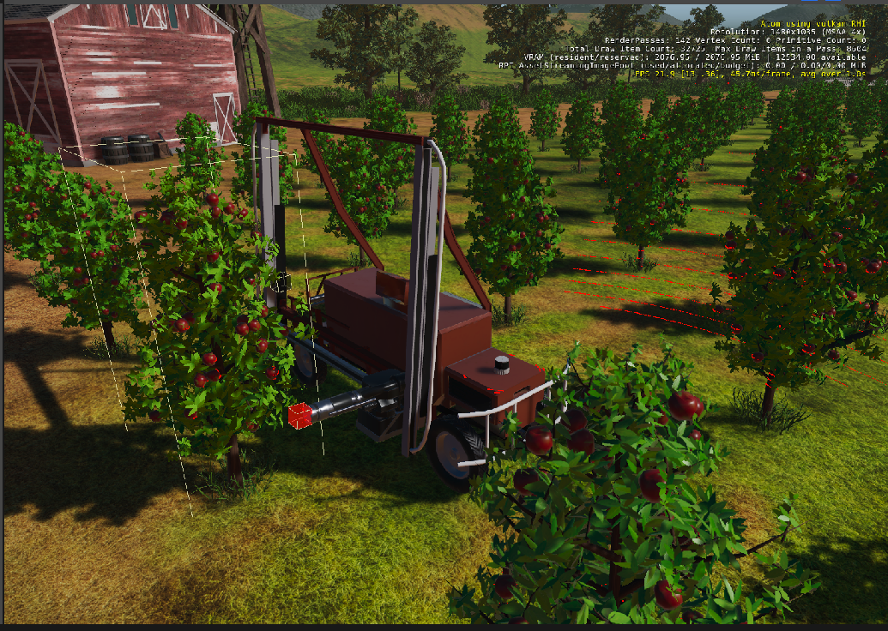

# Robot Harvesting Sample Project

This project demonstrates an example application of [O3DE](https://www.o3de.org/) working with ROS 2.
The integration is realized through [ROS 2 Gem](https://github.com/o3de/o3de-extras/blob/development/Gems/ROS2).

## How does it look like




## The project includes

- **Apple Orchard**, a simulation scene with many rows of apple trees.
- **Apple Kraken**, a robot tasked with apple picking. It is ready to use and also included as an URDF.
    - Multiple Apple Krakens are supported
    - .. and you can spawn them using ROS 2 messages!
- **Custom components** for picking apples, which benefit from direct integration with ROS 2.
    - Yes, you can write ROS 2 code in O3DE!
- **Autonomous operation** which is based on ROS 2 navigation stack and ground truth.
    - Ground truth can be replaced with detectors based on sensor data. Give it a try!
- **Apples**
    - Thousands of apples!

## Simulation scenes (levels)

### Main Level

The main scene of the demo is set in an apple orchard surrounded by a countryside. The orchard is managed by the Apple
Kraken.

The main level is rather performance intensive.

The Apple Kraken is a four-wheeled robot assigned the task of navigating around the orchard, collecting apples and
storing them in its basket.

### Playground Level

The playground scene is much lighter and can be used to quickly prototype with Kraken. There is only a couple
of apple trees and the robot itself.

# Requirements

## Platforms

The project supports the following platforms:

- Ubuntu 22.04 with ROS 2 Humble
- Ubuntu 20.04 with ROS 2 Galactic

💡 ***Note:*** This demo is **not supported on Windows!** 

## O3DE

1. Refer to the [O3DE System Requirements](https://www.o3de.org/docs/welcome-guide/requirements/) documentation to make
   sure that the system/hardware requirements are met.
2. Please follow the instructions
   to [set up O3DE from GitHub](https://o3de.org/docs/welcome-guide/setup/setup-from-github/).
3. **Use the `development` branch**.

The following commands should prepare O3DE:

```
~$ git clone --branch development --single-branch https://github.com/o3de/o3de.git
~$ cd o3de
~/o3de$ git lfs install
~/o3de$ git lfs pull
~/o3de$ git checkout development
~/o3de$ python/get_python.sh
~/o3de$ scripts/o3de.sh register --this-engine
```

## ROS 2 Gem

This project uses the [ROS 2 Gem](https://github.com/o3de/o3de-extras/blob/development/Gems/ROS2).
Please make sure to follow the installation guide
in [README.md](https://github.com/o3de/o3de-extras/blob/development/Gems/ROS2/README.md) file.
To learn more about how the Gem works check out
the [ROS 2 Gem user guide](https://github.com/RobotecAI/o3de-ros2-gem/blob/development/docs/guides/ros2-gem.md).

Note that the Gem instructions include installation of ROS 2 with some additional packages.

The Gem is open to your contributions!

### Registering the Gem

During the step above, make sure to register the Gem in the engine:
`scripts/o3de.sh register --gem-path <PATH_TO_CLONED_ROS2_GEM>`

### Additional ROS 2 packages

The additional packages need to be installed. Use the following command:

```
sudo apt install ros-${ROS_DISTRO}-vision-msgs ros-${ROS_DISTRO}-nav-msgs ros-${ROS_DISTRO}-rmw-cyclonedds-cpp ros-${ROS_DISTRO}-cyclonedds
```

💡 ***Note:*** This is a dependency besides all the packages already required by the ROS 2 Gem.

### Required environment settings

Some commands and environmental variables are necessary for ROS 2 systems, including this demo, to function properly. It is best to add these commands and settings to either `~/.bashrc` or `~/.profile`.

ROS 2 distribution and should always be sourced when building and running the demo and its command line interfaces. For a typical ROS 2 Humble installation, this would mean running the following for each console:

```
source /opt/ros/humble/setup.bash
```

Currently we are observing issues when running navigation with FastDDS (the default middleware for ROS 2 Humble). While the exact cause is yet to be investigated, there are no such issues when running with CycloneDDS. Thus, please set the following:

```
export RMW_IMPLEMENTATION=rmw_cyclonedds_cpp
```

# Building this project

## Build steps

1. Clone this project:

```
git clone https://github.com/o3de/RobotHarvestingDemo.git
```

2. Register this project in O3DE engine. In O3DE directory:
```
scripts/o3de.sh register -pp <PATH_TO_THIS_PROJECT>
```

3. Ensure your [ROS 2 is sourced](https://docs.ros.org/en/rolling/Tutorials/Beginner-CLI-Tools/Configuring-ROS2-Environment.html):

```
echo $ROS_DISTRO
> humble
```

4. Configure build:

```
cmake -B build/linux -G"Ninja Multi-Config" -DLY_DISABLE_TEST_MODULES=ON
```

5. Execute build (this will take a while the first time):

```
cmake --build build/linux --config profile --target RobotHarvestingSample Editor AssetProcessor RobotHarvestingSample.Assets
```

## Launching the Editor


Launch the O3DE Editor (in the Project directory):

```
build/linux/bin/profile/Editor
```

## Building the Navigation package

To build the ROS 2 navigation stack configured for this Project, please follow this [detailed document](kraken_nav/README.md). Do not run it yet if you wish to follow the demo scenario.

# Running the demo scenario

You can try out the demo scenario as presented during ROSCon 2022. Take the following steps:

1. Launch the Editor and select the Main level. Allow it to load.
2. Run the simulation with `Ctrl-G` or by pressing the Play button in the Editor. 
3. When it loads, spawn your first Apple Kraken using the following command: `ros2 service call /spawn_entity gazebo_msgs/srv/SpawnEntity '{name: 'apple_kraken_rusty', xml: 'line1'}'`.
   1. You can learn more about spawning in [this section](#spawning-krakens)
3. Once the simulation is running, start the [navigation stack](kraken_nav/README.md). If you followed all the instructions for setting it up, do the following:
   1. launch the stack for the first robot with `ros2 launch o3de_kraken_nav navigation_multi.launch.py namespace:=apple_kraken_rusty_1 rviz:=True`. 
   1. You should see a new Rviz2 window.
   1. Note that the number index `_1` has been added to the namespace when it was automatically generated by the Spawner.
4. Using RViz2, set the navigation goal using a widget in the toolbar (`2D Goal Pose`). You need to click and drag to indicate direction the robot will be facing. Make sure to set the goal next to an apple tree, to have the tree on the right side. Not too close, not too far. You can set subsequent goals for the robot to move around.
   1. As configured in our package, RViz2 has additional `2D Goal Pose` buttons which are hard-set to work with specific robot namespaces.
   1. Use the button first to the left.
5. Once the robot arrives and stops next to the tree, you can [trigger apple gathering](#triggering-apple-gathering).
6. Either wait for the robot to complete its job (gather all reachable apples) or cancel the gathering through the `/apple_kraken_rusty_1/cancel_apple_gathering` service.
7. Select another navigation goal for the robot.
8. Spawn three other Krakens:
   1. `ros2 service call /spawn_entity gazebo_msgs/srv/SpawnEntity '{name: 'apple_kraken_shiny', xml: 'line2'}' &&
ros2 service call /spawn_entity gazebo_msgs/srv/SpawnEntity '{name: 'apple_kraken_rusty', xml: 'line3'}' &&
ros2 service call /spawn_entity gazebo_msgs/srv/SpawnEntity '{name: 'apple_kraken_shiny', xml: 'line4'}'`
   1. You can also navigate with them using remaining `2D Goal Pose` buttons and trigger gathering events. Follow the instructions in [this section](kraken_nav/README.md#running-nav-stack-for-multiple-vehicles) to launch navigation stack for each Kraken.

💡 ***Note:*** If you would like to start the scenario over, **remember to close all the navigation stacks as well**. You can do this by pressing Ctrl-C in each console where you ran the `ros2 launch o3de_kraken_nav (..)` command.

## Controlling the Apple Kraken

### Navigation

Please refer to [Kraken navigation](kraken_nav/README.md) for instructions.

### Triggering Apple Gathering

Check available services in a terminal using this command:

- `ros2 service list`

If your simulation is running, you should be able to see the apple gathering service(s) listed there.

- It should be named `/apple_kraken_rusty_1/trigger_apple_gathering`. It might have another namespace.

If Apple Kraken is in position, next to a tree, you can trigger apple gathering with this command:

- `ros2 service call /apple_kraken_rusty_1/trigger_apple_gathering std_srvs/srv/Trigger`

You can also cancel a gathering operation in progress by calling another service:

- `ros2 service call /apple_kraken_rusty_1/cancel_apple_gathering std_srvs/srv/Trigger`

### Spawning Krakens

Please read the following section on [Robot Spawner](https://github.com/RobotecAI/o3de-ros2-gem/blob/development/docs/guides/ros2-gem.md#spawner).

To spawn a new Apple Kraken, you can used named points (provided by a Spawner Component) or custom poses. 

#### Available spawn aliases

You can use the spawn service with following robot names:
- apple_kraken_rusty
- apple_kraken_shiny
- apple_kraken (defualts to shiny).
These two robots are functionally the same.

#### Available named spawn poses

There are several named poses (`line1` through `line4`) conveniently placed at entrances to apple orchard rows.

#### Example calls:

Named point:

```
ros2 service call /spawn_entity gazebo_msgs/srv/SpawnEntity '{name: 'apple_kraken', xml: 'line1'}'
```

Free pose:

```
ros2 service call /spawn_entity gazebo_msgs/srv/SpawnEntity '{name: 'apple_kraken', initial_pose: {position:{ x: 4, y: 4, z: 0.2}, orientation: {x: 0.0, y: 0.0, z: 0.0, w: 1.0}}}'
```

## How to use my robot in O3DE?

You can follow up this [guide for re-creating the Apple Kraken prefab](docs/ImportingURDF/URDF_import_guide.md), starting with an URDF file.
This can be very informative for a similar process with another robot.

# Troubleshooting

## Check-list

- Is O3DE running ok with an empty or default project?
- Is ROS 2 installation ok? (check with `ros2 topic pub` etc.)
- Is ROS 2 workspace sourced? (check `ROS_DISTRO`, `AMENT_PREFIX_PATH`)
  - Note this needs to be true before cmake is ran. Re-run configuration and build when in doubt. 
- Do you have compatible settings for crucial ENV variables when running the navigation / orchestration stack in the
  console and when running the simulator?
    - check `RMW_IMPLEMENTATION`, `ROS_DOMAIN_ID` etc.
- Check console for errors as well as logs. From the Project folder, check `user/log/Editor.log`.
- Are simulation topics up when you play the simulation?
    - `ros2 node list` should include `/o3de_ros2_node`
    - `ros2 topic list` should include `/clock`, `/tf` and `/tf_static` regardless of robot presence.
    - topic list should also include `/pc`, `/ackermann_vel` and `/ground_truth_3D_detection` if there is a robot in the
      scene and simulation is running.
        - note that these topics will be namespaced.
    - `ros2 service list` should also show several simulation and robot services such as spawning and apple gathering.

## Other

💡 ***Note:*** Take note that these **vision_msgs** are different between Humble and Galactic,
in particular detection messages which are used by ground truth detector.

# License

For terms please see the LICENSE*.TXT files at the root of this repository.
