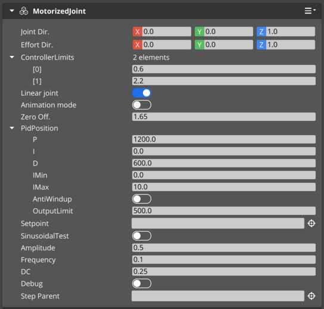
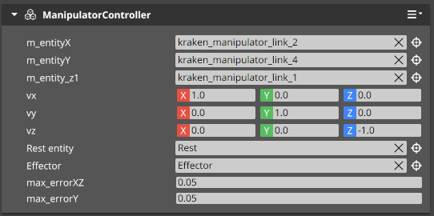
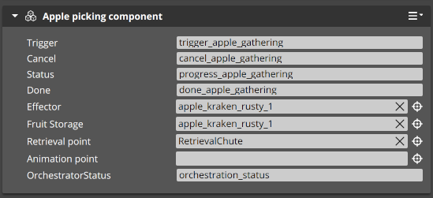
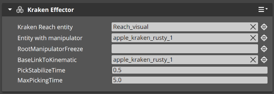

# Importing URDF robot - ROSConDemo tutorial

This document contains a step-by-step tutorial guiding through a URDF import procedure. It covers setting up the vehicle part of the robot. Description of the manipulator part will follow.

## 1. Before you start

- This tutorial uses the [ROSConDemo project](https://github.com/o3de/ROSConDemo). Follow the instructions in the [project README](https://github.com/o3de/ROSConDemo) to build and test the project.
- URDF import requires `xacro` package. It can be installed using:
```bash
sudo apt install ros-$ROS_DISTRO-xacro
```

## 2. Prepare the URDF file

Enter ROSConDemo folder and:

```bash
cd Project/Assets/robotec_freezed_urdf_chasis
xacro apple_kraken.xacro > apple_kraken_new.urdf
```

## 3. Import URDF into O3DE

Run the ROSConDemo O3DE project, load `Main` level and import `apple_kraken_new.urdf` file using `RobotImporter` button. The `apple_kraken_new` prefab should apear in the `Entity Outliner`.

## 4. Set up the vehicle control

In the `apple_kraken_new` prefab:

1. Add a `Wheel controller` component to entities: `wheel_rear_right_link` and `wheel_rear_left_link`. Leave all settings default.
2. Add a `Wheel controller` component to entities: `wheel_front_right_link` and `wheel_front_left_link`. Set the `Steering entity` to `steering_front_right_link` and `steering_front_left_link` respectively (by dragging these entities from the `Entity Outliner`). Leave other properties default.


3. In the `base_link` entity add a `Vehicle Model` component. In this component:
    - Add 2 new axles by clicking `+` next to `Axles`. 
    - In the first of these axles:
      - Set `Axle tag` to `Front`
      - Add 2 wheels by clicking `+` next to `Axle wheels`
      - Set the first of these wheels to `wheel_front_left_link` and the second to `wheel_front_right_link` (by dragging these entities from the `Entity Outliner`). 
      - Turn on `Is it a steering axle` switch.
    - In the second of these axles:
      - Set `Axle tag` to `Rear`
      - Add 2 wheels by clicking `+` next to `Axle wheels`
      - Set the first of these wheels to `wheel_rear_left_link` and the second to `wheel_rear_right_link` (by dragging these entities from the `Entity Outliner`). 
      - Turn on the `Is it a drive axle` switch.
    - In the `Drive model`/`Steering PID` set:
      - `P`: `1000.0`
      - `OutputLimit`: `200.0`
    - In the `Drive model`/`Speed PID` set:
      - `P`: `250.0`
      - `I`: `150.0`
      - `Imax`: `500.0`
      - `OutputLimit`: `500.0`
      - Turn on the `AntiWindUp` switch
    - In the `Vehicle limits` set `Speed limit` to `3.0`
    - Leave all the other settings default. The component should look like this:


4. In the `base_link` entity select `ROS2 Robot control` component and change `Topic` to `ackermann_vel` and `Steering` to `Ackermann`.


5. In the `base_link` entity add a `Ackermann Control` component. 
6. In the `base_link` entity add a `Tag` component. Add 1 tag by clicking `+` next to `Tags` and set the name to `Robot`.
7. In the `base_link` entity add an `Input` component and in the `Input to event bindings` field select `mobile_robot_control_keyboard.inputbindings`.


## 5. Set collision layers and Rigid Body parameters

- Browse each entity in the `apple_kraken_new` prefab and find all `PhysX Collider` components. Change `Collision Layer` to `Robot` in each.
- Select the `PhysX Rigid Body` component and turn off `Gravity enabled` checkbox in following entities:
    - `kraken_manipulator_link_1`
    - `kraken_manipulator_link_2`
    - `kraken_manipulator_link_3`
    - `kraken_manipulator_link_4`
    - `Effector`

## 6. Test robot mobility

Now it is a good time to test the robot. Check that the robot is located over the ground (but not too high) and set a camera to see the robot. Click the Play button in the right-top corner of the O3DE window, or press `Ctrl G`. You should be able to control robot movement using arrow keys on the keyboard.

## 7. Add lidar

Select the `lidar_mount` entity in the `apple_kraken_new` prefab, open the right-click menu and select `Instantiate Prefab`. Select `ROSConDemo/Project/Prefabs/LidarKraken.prefab` and click `OK`. Enter the `LidarKraken` prefab, select `Sensor` entity and change:
1. Set `Ignore layer` to `True`
2. Set `Ignored layer index` to `1`


## 8. Test robot navigation

Select `base_link` entity and change it's name to `apple_kraken_rusty_1`. This step assures, that we are using correct namespace.


Follow instructions in the [o3de_kraken_nav](https://github.com/RobotecAI/o3de_kraken_nav) to install the navigation stack. After the `Installation` part run the O3DE simulation (`Ctrl G`), switch to terminal and perform:

```bash
source /opt/ros/$ROS_DISTRO/setup.bash
cd ~/o3de_kraken_ws
source ./install/setup.bash
export RMW_IMPLEMENTATION=rmw_cyclonedds_cpp
ros2 launch o3de_kraken_nav navigation_multi.launch.py namespace:=apple_kraken_rusty_1 rviz:=True
```

You should see something like this.


## 9. Set up the manipulator

In the `apple_kraken_new` prefab:

1. Open the `kraken_manipulator_link_1` entity and add a `MotorizedJoint` Component. Perform:
- Set `ControllerLimits` to `0.6` and `2.2`
- Turn off the `Animation mode` switch
- Set `Zero off.` to `1.65`
- In `PidPosition` set:
  - `P` to `1200.0`
  - `D` to `600.0`
  - `OutputLimit` to `500.0`
- Turn off the `SinusoidalTest` switch



2. Open the `kraken_manipulator_link_2` entity and add a `MotorizedJoint` Component. Perform:
- Set `Joint Dir.` to `1.0, 0.0, 0.0`
- Set `ControllerLimits` to `-0.5` and `1.5`
- Turn off the `Animation mode` switch
- In `PidPosition` set:
  - `P` to `1500.0`
  - `D` to `600.0`
  - `OutputLimit` to `500.0`
- Turn off the `SinusoidalTest` switch


3. Open the `kraken_manipulator_link_4` entity and add a `MotorizedJoint` Component. Perform:
- Set `Joint Dir.` to `0.0, -1.0, 0.0`
- Set `ControllerLimits` to `0.35` and `0.95`
- Set `Zero off.` to `0.36`
- Turn off the `Animation mode` switch
- In `PidPosition` set:
  - `P` to `250.0`
  - `D` to `50.0`
  - `OutputLimit` to `250.0`
- Turn off the `SinusoidalTest` switch
- Set `Step Parent` to `kraken_manipulator_link_2` (by dragging entity from the Entity Outliner)


4. Open the `base_link` or `apple_kraken_rusty_1` if you performed test form step 8 entity and:
- Add a `ManipulatorController` Component. Perform:
  - Set `m_entityX` to `kraken_manipulator_link_2` (by dragging entity from the Entity Outliner)
  - Set `m_entityY` to `kraken_manipulator_link_4` (by dragging entity from the Entity Outliner)
  - Set `m_entityZ1` to `kraken_manipulator_link_1` (by dragging entity from the Entity Outliner)
  - Set `vz` to `0.0, 0.0, -1.0` 
  - Set `Rest entity` to `Rest` (by dragging entity from the Entity Outliner)
  - Set `Effector` to `Effector` (by dragging entity from the Entity Outliner)



- Add a `Apple picking component` Component. Perform:
  - Set `Effector` to `base_link` or `apple_kraken_rusty_1` if you performed test form step 8 (by dragging entity from the Entity Outliner)
  - Set `Fruit Storage` to `base_link` or `apple_kraken_rusty_1` if you performed test form step 8 (by dragging entity from the Entity Outliner)
  - Set `Retrieval point` to `RetrievalChute` (by dragging entity from the Entity Outliner)



- Add a `Kraken Effector` Component. Perform:
  - Set `Kraken Reach entity` to `Reach_visual` (by dragging entity from the Entity Outliner)
  - Set `Entity with manipulator` to `base_link` or `apple_kraken_rusty_1` if you performed test form step 8 (by dragging entity from the Entity Outliner)
  - Set `Entity with probe apples` to `Effector` (by dragging entity from the Entity Outliner)
  - Set `BaseLinkToKinematic` to `base_link` or `apple_kraken_rusty_1` if you performed test form step 8 (by dragging entity from the Entity Outliner)
  - Set `ManipulatorRestPoint` to `Rest` (by dragging entity from the Entity Outliner)




## 10. Test the manipulator

Place the Kraken next to one of apple trees:


Run simulation (`Ctrl G`), switch to terminal and run:

```bash
source /opt/ros/$ROS_DISTRO/setup.bash
ros2 service call /apple_kraken_rusty_1/trigger_apple_gathering std_srvs/srv/Trigger
````

You should see the manipulator picking apples.