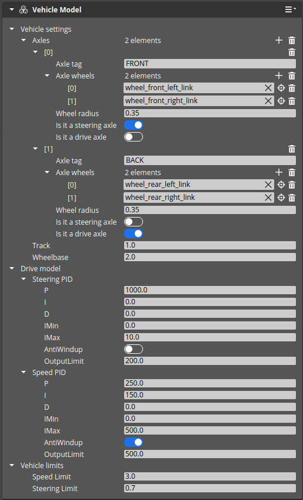
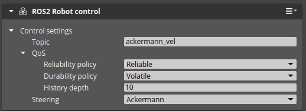
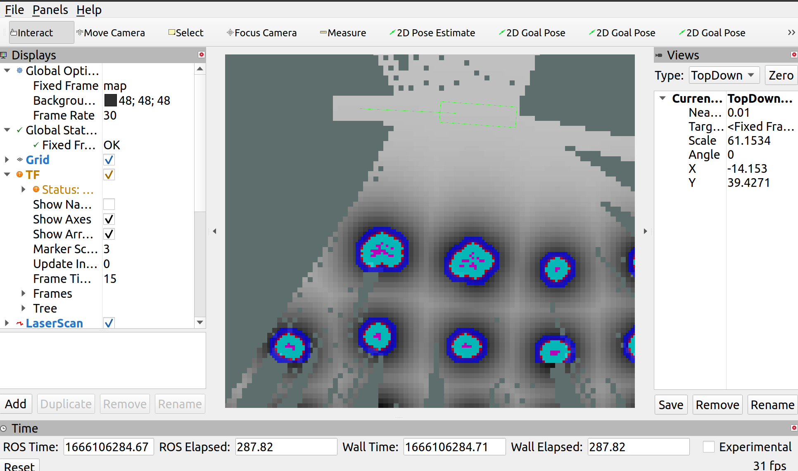

# Importing URDF robot - ROSConDemo tutorial

## Prepare the URDF file

Enter ROSConDemo folder and:


```bash
cd Project/Assets/robotec_freezed_urdf_chasis
xacro apple_kraken.xacro > apple_kraken_new.urdf
```

## Import URDF into O3DE

Run the ROSConDemo O3DE project and follow these steps

Import `apple_kraken_new.urdf` file using `RobotImporter` button. The `apple_kraken_new` prefab should apear in the `Entity Outliner`.

## Set up vehicle control

In the `apple_kraken_new` prefab:

1. Add a `Wheel controller` component to entities: `wheel_rear_right_link` and `wheel_rear_right_link`. Leave all settings default.
2. Add a `Wheel controller` component to entities: `wheel_front_right_link` and `wheel_front_left_link`. Set the `Steering entity` to `steering_front_right_link` and `steering_front_left_link` respectively (by dragging these entities from the `Entity Outliner`). Leave other properties default.


3. In the `base_link` entity add a `Vehicle Model` component. In this component:
    - Add 2 new axles by clicking `+` next to `Axles`. 
    - In the first of these axles:
      - set `Axle tag` to `Front`
      - Add 2 wheels by clicking `+` next to `Axle wheels`
      - Set the first of these wheels to `wheel_front_left_link` and the second to `wheel_front_right_link` (by dragging these entities from the `Entity Outliner`). 
      - Turn on `Is it a steering axle` switch.
    - In the second of these axles:
      - set `Axle tag` to `Rear`
      - Add 2 wheels by clicking `+` next to `Axle wheels`
      - Set the first of these wheels to `wheel_rear_left_link` and the second to `wheel_rear_right_link` (by dragging these entities from the `Entity Outliner`). 
      - Turn on the `Is it a drive axle` switch.
    - In the `Drive model`/`Steering PID` set:
      - `P`: `1000.0`
      - `OutputLimit`: `200.0`
    - In the `Drive model`/`Speed PID` set:
      - `P`: `250.0`
      - `I`: `150.0`
      - `Imax`: `500.0`
      - `OutputLimit`: `500.0`
      - Turn on the `AntiWindUp` switch
    - In the `Vehicle limits` set `Speed limit` to `3.0`
    - Leave all the other settings default. The component should look like this:




4. In the `base_link` entity select `ROS2 Robot control` component and change `Topic` to `ackermann_vel` and `Steering` to `Ackermann`.




5. In the `base_link` entity add a `Ackermann Control` component. 
6. In the `base_link` entity add a `Tag` component. Add 1 tag by clicking `+` next to `Tags` and set the name to `Robot`.
7. In the `base_link` entity add an `Input` component and in the `Input to event bindings` field select `mobile_robot_control_keyboard.inputbindings`.


## Set collision layers and parameters

- Browse each entity and find `PhysX Collider` components. Change `Collision Layer` to `Robot` in each.
- Select `Reach` entity, select `PhysX Collider` and change `Collides With` to `None`

## Test robot mobility

Now it is a good time to test the robot. Check that the robot is standing on the ground and set a camera to see the robot. Click the Play button in the right-top corner of the O3DE window, or press `Ctrl G`. You should be able to control robot movement using arrow keys on the keyboard.

## Add lidar

Select the `lidar_mount` entity, open the right-click menu and select `Instantiate Prefab`. Select `ROSConDemo/Project/Prefabs/LidarKraken.prefab` and click `OK`. Enter the `LidarKraken` prefab, select `Sensor` entity and change:
1. Set `Ignore layer` to `True`
2. Set `Ignored layer index` to `1`


## Test robot navigation

Select `base_link` entity and change it's name to `apple_kraken_rusty_1`. This step assures, that we are using correct namespace.


Follow instructions in the [o3de_kraken_nav](https://github.com/RobotecAI/o3de_kraken_nav) to install the navigation stack. After the `Installation` part run the O3DE simulation, switch to terminal and perform:

```bash
cd ~/o3de_kraken_ws
source ./install/setup.bash
export RMW_IMPLEMENTATION=rmw_cyclonedds_cpp
ros2 launch o3de_kraken_nav navigation_multi.launch.py namespace:=apple_kraken_rusty_1 rviz:=True
```

You should see something like this.



